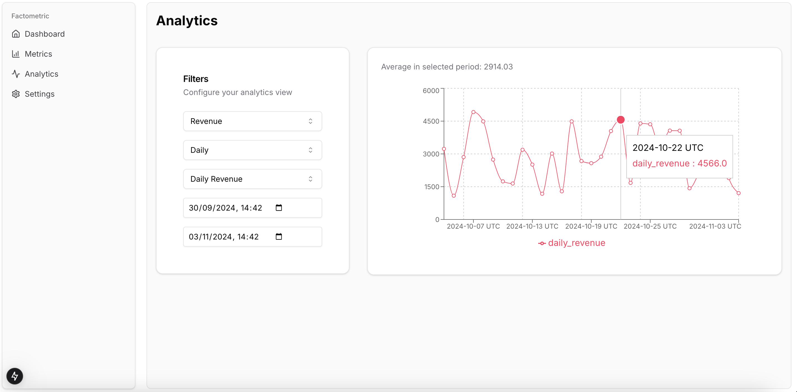

# Factometric

A modern full-stack application for visualizing and managing metrics data with real-time analytics capabilities.




## Overview

The project consists of two main components:

- [**Frontend**](web/README.md): A Next.js 15.0 application with TypeScript and Tailwind CSS
- [**Backend**](api/README.md): A Rails 7.1 API with PostgreSQL database

## Architecture

### Frontend Architecture

- **Framework**: Next.js 15.0 with App Router
- **Type Safety**: Full TypeScript implementation
- **Component Structure**: 
  - UI components built with Radix UI primitives
  - Shadcn/UI for consistent design system
  - Custom chart components using Recharts
- **API Integration**: Custom API client with type-safe requests
- **State Management**: React hooks for local state
- **Form Handling**: React Hook Form with Zod validation

### Backend Architecture

- **Framework**: Rails 7.1 API-only mode
- **Database**: PostgreSQL with optimized schema for time-series data
- **API Design**: RESTful endpoints with versioning (v1)
- **Pagination**: Implemented using Pagy gem
- **CORS**: Configured for secure cross-origin requests
- **Error Handling**: Standardized error responses

## Key Features

- 📊 Real-time metrics dashboard
- 📈 Interactive analytics visualization
- 🔄 CRUD operations for metrics data
- 🔒 Type-safe API integration
- 📋 Data filtering and pagination
- 📊 Time-series data analysis

## Getting Started

1. Clone the repository
2. Set up the backend:
```bash
cd api
bundle install
rails db:create
rails db:migrate
rails db:seed
rails s
```

3. Set up the frontend:
```bash
cd web
npm install
cp .env.example .env.local
npm run dev
```

4. Open [http://localhost:3000](http://localhost:3000)

## Development Guidelines

- Follow TypeScript best practices
- Write tests for critical functionality
- Use conventional commits
- Follow the established component patterns
- Maintain consistent code style

## Next Steps

1. **Authentication & Authorization**
   - Implement user authentication
   - Role-based access control
   - API token management

2. **Enhanced Analytics**
   - Add more visualization options
   - Implement data export features
   - Add custom metric calculations

3. **Performance Optimization**
   - Implement caching strategy
   - Optimize database queries

4. **Testing**
   - Increase test coverage
   - Add frontend tests
   - Add end-to-end tests

5. **DevOps**
   - Set up Docker
   - Set up CI/CD pipeline
   - Add monitoring and logging

## Contributing

1. Fork the repository
2. Create your feature branch
3. Commit your changes
4. Push to the branch
5. Create a Pull Request

## License

This project is licensed under the MIT License - see the LICENSE file for details.
